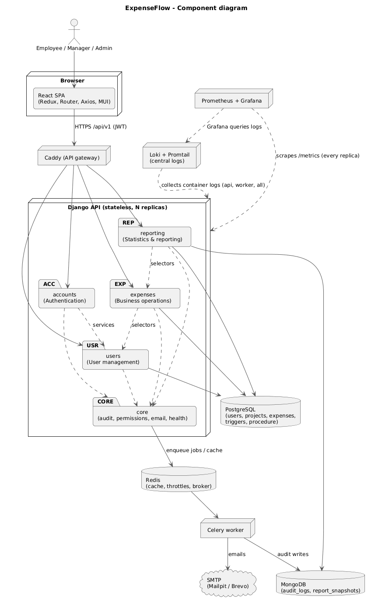
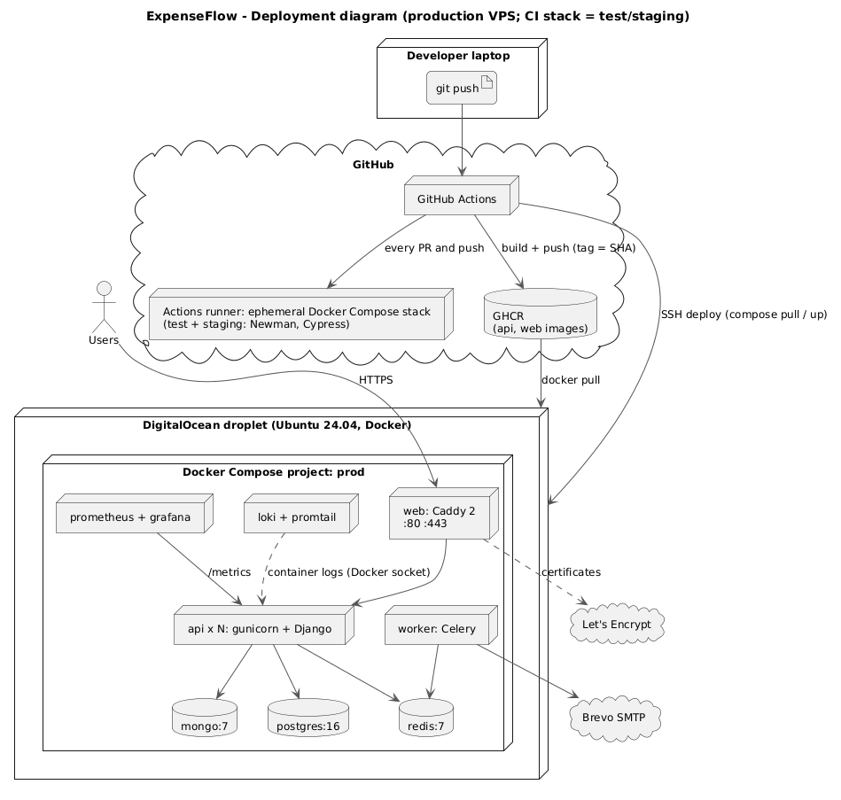
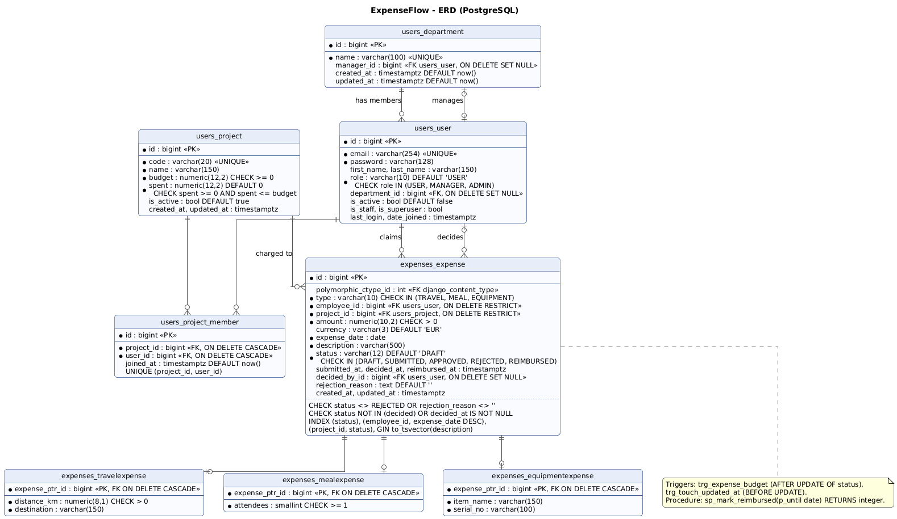
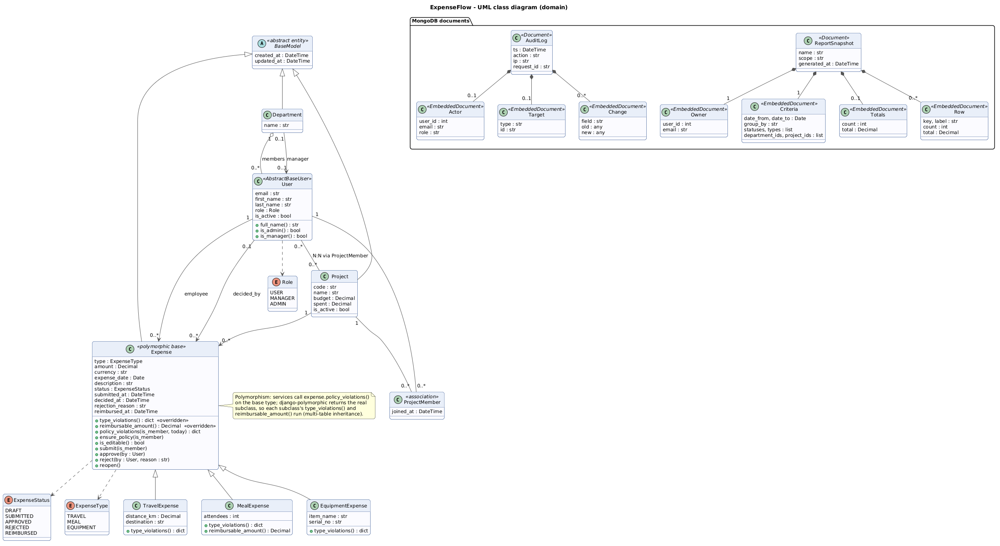
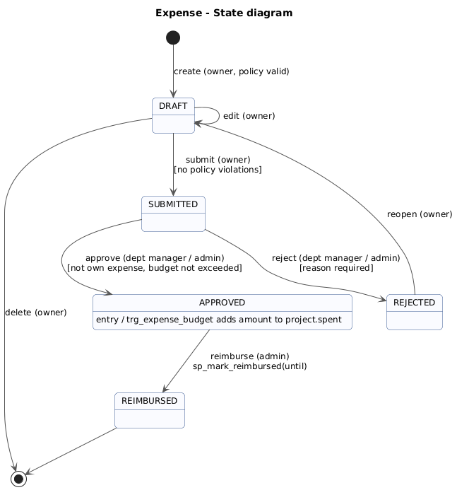
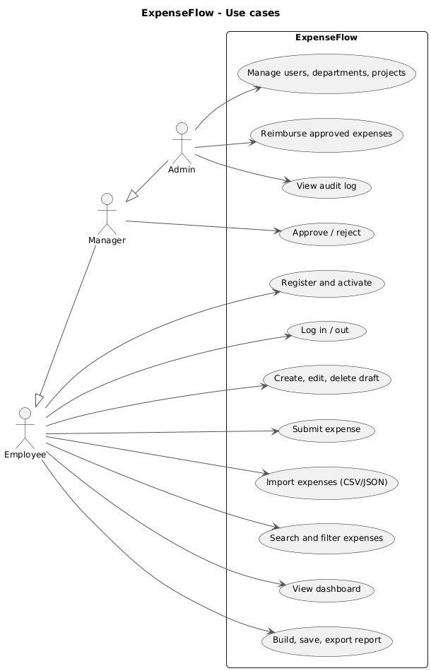
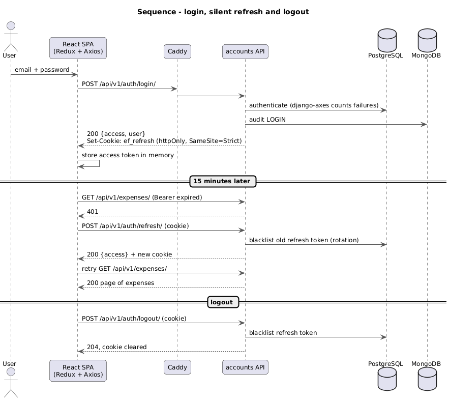
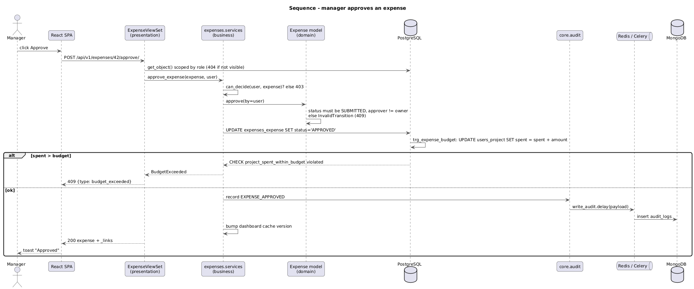
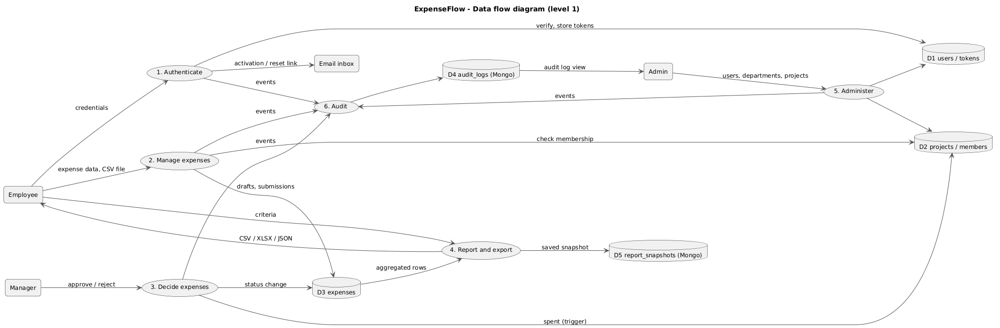
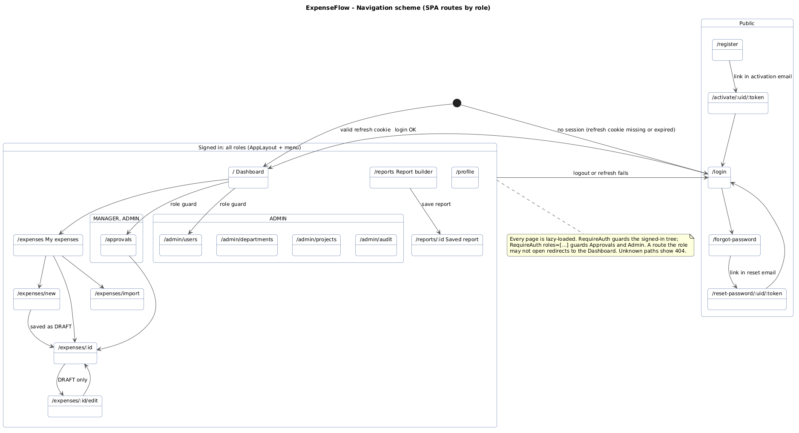

# Phase II: System design

ExpenseFlow · UBT Lab Course 2 · Rreze Konjusha (solo project) · Version 1.0

ExpenseFlow is a stateless modular monolith: one Django REST API with four business modules behind a Caddy
gateway, PostgreSQL for relational data with its rules enforced in the database, MongoDB for the audit log and
report snapshots, and Redis for cache, rate limits and the Celery queue. Every diagram below is PlantUML in
`docs/diagrams/` (rendered to `docs/diagrams/rendered/`) and was checked against the code and the live database.

## 1. Architecture

### 1.1 Logical architecture



Faza II section 1 allows MVC or MVVM with separated Presentation, Business Logic, Persistence and Integration
layers for smaller systems. Every module follows the same four layers:

| Layer | Files in each module | Rule |
| --- | --- | --- |
| Presentation | `api/views.py`, `api/serializers.py`, `api/urls.py` | HTTP only: parse, validate shape, call one service, serialise |
| Business logic | `services.py`, model methods, `policies.py` | All rules and state transitions; no HTTP objects; one transaction per use case |
| Persistence | `models.py`, `selectors.py`, `documents.py` | Queries and storage; selectors scope every query by role |
| Integration | `core/integrations/`, `core/tasks.py`, `core/mongo.py` | Email (with circuit breaker), Celery tasks, MongoDB connection |

| Module | Faza II module | Public interface | Owns |
| --- | --- | --- | --- |
| `accounts` | Authentication | `/api/v1/auth/*` | Register, activate, login, refresh, logout, password change and reset |
| `users` | User management | `/api/v1/users/`, `/departments/`, `/projects/` | User, Department, Project, ProjectMember |
| `expenses` | Business operations | `/api/v1/expenses/*` | Expense hierarchy, policies, workflow, import |
| `reporting` | Statistics and reporting | `/api/v1/reports/*`, `/audit-logs/` | Dashboard, report builder, snapshots, export |
| `core` | Shared kernel | `/health/`, `/metrics` | Base model, permissions, error format, audit, email, logging |

Three import-linter contracts run in CI and fail the build when broken: each module is layered
`api -> services -> selectors -> models`; `core` imports no business module; business modules never import
another module's API layer. Each module has technical documentation in `docs/modules/`, logs as JSON with its
module name and the request id, and exposes Prometheus metrics.

### 1.2 Physical architecture



| Container | Image | Role | Scales |
| --- | --- | --- | --- |
| `web` | Caddy 2 + built SPA | API gateway: HTTPS, static SPA, reverse proxy, round-robin load balancing, security headers | 1 |
| `api` | Python 3.12, gunicorn, Django | REST API, stateless | N replicas (`--scale api=N`) |
| `worker` | same image as `api` | Celery: emails and audit writes off the request path | N |
| `postgres` | postgres:16-alpine | Relational data, constraints, triggers, procedure | 1 (volume) |
| `mongo` | mongo:7 | Audit logs, report snapshots | 1 (volume) |
| `redis` | redis:7-alpine | Cache, throttle counters, Celery broker | 1 |
| `prometheus`, `grafana` | prom/prometheus, grafana/grafana | Metrics and dashboards | 1 |
| `loki`, `promtail` | grafana/loki, grafana/promtail | Central logs from every container | 1 |

**Service discovery and gateway.** Caddy resolves the `api` service name through Docker DNS every 5 seconds
(`dynamic a api 8000`) and balances across every replica with health checks on `/health/`; Prometheus finds the
replicas the same way. This covers the Faza II "service discovery + API gateway" requirement without a separate
registry; Eureka or Consul is the step for a multi-host deployment.

**Asynchronous messaging.** Celery on Redis carries the emails and audit writes. RabbitMQ or Kafka and gRPC
belong to the microservices path and are documented as future work (final report).

## 2. Relational data model (PostgreSQL)



Eight business tables in third normal form. Relationships: Department 1:N User; Department 0..1 manager (User);
User N:N Project through ProjectMember; User 1:N Expense (employee); Project 1:N Expense; User 0..1:N Expense
(decided_by); Expense 1:1 subtype (multi-table inheritance).

### 2.1 Constraints (read from the live database)

| Table | Constraint | Definition |
| --- | --- | --- |
| users_user | `user_role_valid` | `CHECK (role IN ('USER','MANAGER','ADMIN'))`, `DEFAULT 'USER'` |
| users_user | `users_user_email_key` | `UNIQUE (email)` |
| users_department | `users_department_name_key` | `UNIQUE (name)` |
| users_project | `project_budget_non_negative` | `CHECK (budget >= 0)` |
| users_project | `project_spent_within_budget` | `CHECK (spent >= 0 AND spent <= budget)`, `spent DEFAULT 0` |
| users_project | `users_project_code_key` | `UNIQUE (code)` |
| users_project_member | `project_member_unique` | `UNIQUE (project_id, user_id)` |
| expenses_expense | `expense_amount_positive` | `CHECK (amount > 0)` |
| expenses_expense | `expense_type_valid`, `expense_status_valid` | `CHECK` against the enumerations; `status DEFAULT 'DRAFT'`, `currency DEFAULT 'EUR'` |
| expenses_expense | `expense_rejection_has_reason` | `CHECK (status <> 'REJECTED' OR rejection_reason <> '')` |
| expenses_expense | `expense_decided_has_timestamp` | `CHECK (status NOT IN ('APPROVED','REJECTED','REIMBURSED') OR decided_at IS NOT NULL)` |
| expenses_travelexpense | `travel_distance_positive` | `CHECK (distance_km > 0)` |
| expenses_mealexpense | `meal_attendees_min_one` | `CHECK (attendees >= 1)` |

Defaults are database defaults (`db_default`), so rows inserted outside Django get them too.

**Foreign keys and delete rules.** Django only emulates `ON DELETE CASCADE` in Python; a migration recreates
the keys so PostgreSQL enforces them:

| Child | Parent | ON DELETE |
| --- | --- | --- |
| users_project_member.project_id, .user_id | users_project, users_user | CASCADE |
| expenses_travel/meal/equipmentexpense.expense_ptr_id | expenses_expense | CASCADE |
| expenses_expense.employee_id, .project_id | users_user, users_project | RESTRICT (an expense keeps its owner and project) |
| expenses_expense.decided_by_id, users_user.department_id, users_department.manager_id | users_user, users_department | SET NULL |

### 2.2 Indexes

| Index | Definition | Serves |
| --- | --- | --- |
| `expense_status_idx` | btree (status) | Approval queue, dashboards |
| `expense_employee_date_idx` | btree (employee_id, expense_date DESC) | "My expenses", newest first |
| `expense_project_status_idx` | btree (project_id, status) | Budget and project reports |
| `expense_description_fts` | GIN (to_tsvector('simple', description)) | Full-text search (`?q=`) |
| FK indexes | btree on every foreign key | Joins, cascades |

### 2.3 Trigger and stored procedure

`trg_expense_budget` keeps `users_project.spent` in step with approvals. Because the CHECK on `spent <= budget`
is evaluated inside the same transaction, an approval that would overrun the budget fails in the database; the
service turns that error into HTTP 409 "Project X budget would be exceeded".

```sql
CREATE TRIGGER trg_expense_budget AFTER UPDATE OF status ON expenses_expense
  FOR EACH ROW EXECUTE FUNCTION fn_expense_budget();

CREATE FUNCTION fn_expense_budget() RETURNS trigger LANGUAGE plpgsql AS $$
BEGIN
  IF NEW.status = 'APPROVED' AND OLD.status IS DISTINCT FROM 'APPROVED' THEN
    UPDATE users_project SET spent = spent + NEW.amount WHERE id = NEW.project_id;
  END IF;
  RETURN NEW;
END $$;
```

`trg_touch_updated_at` (BEFORE UPDATE on expenses, projects, departments) sets `updated_at = now()` for any writer.

`sp_mark_reimbursed(p_until date) RETURNS integer` reimburses in one set-based statement and returns the count;
the admin's "Reimburse" action calls it with a bound parameter:

```sql
CREATE FUNCTION sp_mark_reimbursed(p_until date) RETURNS integer LANGUAGE plpgsql AS $$
DECLARE n integer;
BEGIN
  UPDATE expenses_expense SET status = 'REIMBURSED', reimbursed_at = now()
   WHERE status = 'APPROVED' AND expense_date <= p_until;
  GET DIAGNOSTICS n = ROW_COUNT;
  RETURN n;
END $$;
```

## 3. Domain model: inheritance and polymorphism



- **Abstract entity.** `BaseModel` (abstract, no table) gives `created_at` and `updated_at` to Department,
  Project and Expense.
- **Inheritance.** `Expense` is the polymorphic base with the shared fields and the lifecycle methods;
  `TravelExpense`, `MealExpense` and `EquipmentExpense` add their fields in their own tables (multi-table
  inheritance, 1:1 on `expense_ptr_id`).
- **Polymorphism.** `Expense.policy_violations()` merges the common rules (project membership, date not in the
  future and not older than 90 days) with `self.type_violations()`, which each subclass overrides:
  travel caps the amount at 0.40 EUR per km, meal at 25 EUR per attendee (and overrides
  `reimbursable_amount()` to `min(amount, attendees x 25)`), equipment requires a serial number and caps at
  1000 EUR. django-polymorphic returns the real subclass from any `Expense` query, so services call one method
  and the right rule runs.
- **Complex relations.** 1:N (Department-User, Project-Expense, User-Expense), N:N with attributes
  (User-Project through ProjectMember with `joined_at`), 0..1 (Department manager, decided_by).
- **Validation in three places.** Serializers check shape and reject `<` `>` in free text; model methods guard
  every state transition (`InvalidTransition`) and the policies; the database enforces constraints and the budget.

### 3.1 Expense lifecycle



| From | Action | To | Who | Guard |
| --- | --- | --- | --- | --- |
| (new) | create | DRAFT | owner | serializer valid |
| DRAFT | edit, delete | DRAFT, gone | owner | |
| DRAFT | submit | SUBMITTED | owner | no policy violations |
| SUBMITTED | approve | APPROVED | department manager or admin | not own expense; budget trigger passes |
| SUBMITTED | reject | REJECTED | department manager or admin | reason required |
| REJECTED | reopen | DRAFT | owner | |
| APPROVED | reimburse | REIMBURSED | admin | via `sp_mark_reimbursed` |

Each transition is one service call inside `transaction.atomic()`, writes one audit entry and bumps the
dashboard cache version.

## 4. Document data model (MongoDB)

| Collection | Document | Embedded | Indexes |
| --- | --- | --- | --- |
| `audit_logs` | `ts`, `action`, `ip`, `request_id` | `actor {user_id, email, role}`, `target {type, id}`, `changes [{field, old, new}]` | `{ts: -1}`, `{actor.user_id: 1, ts: -1}`, `{action: 1}` |
| `report_snapshots` | `name`, `scope`, `generated_at` | `owner {user_id, email}`, `criteria {dates, group_by, filters}`, `rows [{key, label, count, total}]`, `totals {count, total}` | `{owner.user_id: 1, generated_at: -1}` |

**Why MongoDB for these two.** Audit entries are append-only, high-volume and differ per action; a report's rows
have a different shape for every `group_by`. Neither is joined back into relational queries.

**Calculated denormalisation.** The actor's email and role are copied into every audit entry when it is written,
so history stays true after a user changes role or leaves. A snapshot stores its owner's email, the scope it was
generated for (`all`, `department:3`, `user:7`) and the computed rows and totals, so opening or exporting a saved
report never re-runs the query and always shows what was saved.

**Sharding strategy (designed, single node today).** `audit_logs`: hashed shard key on `actor.user_id`, which
spreads writes evenly and keeps one user's history on one shard. `report_snapshots`: shard key
`{owner.user_id: 1, generated_at: 1}`, matching the only query pattern (a user's snapshots, newest first).

**Consistency.** Audit writes go through Celery and are eventually consistent by design: the business action
never waits for or fails because of the audit log (if the broker is down, the entry is written synchronously).
They use the server's default acknowledgement. Report snapshots are written with `w: "majority"`, so on a replica
set a saved report survives a primary failover. PostgreSQL stays the source of truth; MongoDB never holds data
the business rules depend on.

## 5. Behaviour

| Diagram | Shows |
| --- | --- |
|  | Use cases per role |
|  | Login, silent refresh with rotation, logout |
|  | Approve call: permission, transition, trigger, audit, cache |
|  | Data flow between users, processes and the three stores |

## 6. API design

Contract: OpenAPI 3.0.3 in `docs/api/openapi.yml`, generated from the code by drf-spectacular (regenerated and
compared during this design review: identical). Live documentation at `/api/docs/` (Swagger UI).

| Concern | Design |
| --- | --- |
| Style and versioning | REST, JSON, every path under `/api/v1/`; a breaking change goes to `/api/v2/` while v1 stays |
| Authentication | `Authorization: Bearer <access JWT>` (15 min, claims `user_id`, `role`, `department_id`, `email`); refresh token only in an httpOnly, Secure, SameSite=Strict cookie on `/api/v1/auth/`, rotated and blacklisted on each use |
| Authorisation | Role permission classes plus queryset scoping in selectors (USER: own, MANAGER: own department, ADMIN: all); objects outside the scope return 404 |
| Errors | One shape: `{"type", "detail", "errors": {field: [messages]}}` |
| Pagination | `?page=`, `?page_size=` (20 by default, 100 max); response `count`, `next`, `previous`, `results` |
| Filtering and search | `?status=&type=&project=&employee=&date_from=&date_to=&amount_min=&amount_max=`, full-text `?q=`, `?ordering=` on date, amount, status, created |
| HATEOAS | Every expense carries `_links` with `self` and exactly the transitions the caller may take now (`update`, `delete`, `submit`, `approve`, `reject`, `reopen`); the UI draws its buttons from them |
| Rate limiting | Redis-backed: 60/min anonymous, 600/min authenticated, 5/min on login and password endpoints; django-axes locks an account for 15 min after 5 failures |
| Caching | Dashboard per scope in Redis for 300 s; every expense transition bumps a version key so no stale numbers are served |

| Module | Endpoints |
| --- | --- |
| Auth | `POST auth/register/`, `auth/activate/`, `auth/login/`, `auth/refresh/`, `auth/logout/`, `auth/password/change/`, `auth/password/forgot/`, `auth/password/reset/`; `GET PATCH auth/me/` |
| Users | `GET POST users/`, `GET PUT PATCH DELETE users/{id}/` (DELETE deactivates); same for `departments/` and `projects/`; `PUT projects/{id}/members/` |
| Expenses | `GET POST expenses/`, `GET PUT PATCH DELETE expenses/{id}/`, `POST expenses/{id}/submit/`, `/approve/`, `/reject/`, `/reopen/`, `POST expenses/import/`, `POST expenses/reimburse/` |
| Reporting | `GET reports/dashboard/`, `POST reports/run/`, `GET POST reports/`, `GET DELETE reports/{id}/`, `GET reports/{id}/export/?format=csv|xlsx|json`, `GET audit-logs/` |
| Operations | `GET /health/` (PostgreSQL, MongoDB, Redis; 503 if any is down), `GET /metrics` (internal, not routed by Caddy) |

30 paths in total. Tests per endpoint: pytest integration tests (happy, negative, edge) and the Newman collection.

## 7. User interface design

### 7.1 Navigation scheme



| Route | Page | Roles |
| --- | --- | --- |
| `/login`, `/register`, `/activate/:uid/:token`, `/forgot-password`, `/reset-password/:uid/:token` | Authentication | public |
| `/` | Dashboard: KPI cards and 6-month chart, content per role | all |
| `/expenses`, `/expenses/new`, `/expenses/:id`, `/expenses/:id/edit`, `/expenses/import` | List with filters and search, form with fields per type, detail with actions from `_links`, import | all |
| `/approvals` | Department queue | MANAGER, ADMIN |
| `/reports`, `/reports/:id` | Report builder, saved report with export | all (scoped) |
| `/admin/users`, `/admin/departments`, `/admin/projects`, `/admin/audit` | CRUD tables with dialogs, audit log | ADMIN |
| `/profile` | Profile and password change | all |

### 7.2 Frontend architecture

- **Components.** Feature folders (`auth`, `expenses`, `approvals`, `reports`, `admin`, `profile`) hold pages;
  shared components (`AppLayout`, `RequireAuth`, `ConfirmDialog`, `StatusChip`, form fields) live in `components/`.
- **State.** Redux Toolkit holds only the session (user, access token, status); server data is fetched per page.
  The access token lives in memory, never in localStorage.
- **API access.** One Axios client adds the bearer token; on a 401 it refreshes once (shared by parallel calls
  and across tabs) and replays the request.
- **Routing.** React Router with nested, lazy-loaded routes and role guards (`RequireAuth roles=[...]`).
- **UX.** MUI (Material Design); react-hook-form with yup for per-type validation on blur and submit, plus server
  errors mapped to fields; confirmation modals for destructive actions; toast after every mutation; server-side
  paging in data grids; the menu collapses into a drawer under 900 px.
- **Prototypes.** Figma prototypes of 8 key screens follow the specification in `figma-spec.md`.

## 8. Security design

| Threat | Control |
| --- | --- |
| SQL injection | ORM parameter binding; raw SQL only in migrations and the procedure call with a bound parameter |
| XSS | Serializers reject `<` and `>` in free text; React escapes output; CSP `default-src 'self'` from Caddy |
| CSRF | The API authenticates with a bearer header, which a browser never attaches on its own; the refresh cookie is SameSite=Strict and scoped to `/api/v1/auth/` |
| Brute force | 5/min throttle on login and password endpoints; django-axes lockout |
| Token theft | 15-minute access token in memory; refresh rotation with blacklist detects reuse |
| Transport | HTTPS everywhere (Caddy internal CA locally, Let's Encrypt in production), HSTS 1 year |
| Headers | nosniff, X-Frame-Options DENY, Referrer-Policy, Permissions-Policy, CSP |
| Enumeration | Forgot-password answers the same for known and unknown emails |

## 9. Traceability to the Faza II requirements

| Faza II item | Section |
| --- | --- |
| 1. Architecture: horizontal scaling, layers, gateway, discovery | 1.1, 1.2 |
| 2. RESTful API, OpenAPI 3.0, JWT, rate limiting, caching, HATEOAS, versioning, tests per endpoint | 6 |
| 3. Enterprise frameworks, Redux, messaging | 1, 7.2 (messaging: Celery on Redis; RabbitMQ, Kafka, gRPC as future work) |
| 4. Modules with API, docs, logging and monitoring | 1.1, `docs/modules/` |
| 5. UML class diagram, inheritance, polymorphism, abstract entities, 1:N, N:N, embedded entities, validation | 3, 4 |
| 6. GUI per role, validation, modals, toasts, lazy loading, UI library, Storybook | 7 (Storybook: optional, see test plan) |
| 7. ERD, CHECK, DEFAULT, UNIQUE, FK CASCADE, indexes, procedure, trigger; NoSQL structure, denormalisation, sharding, consistency | 2, 4 |
| 8. Component, sequence, deployment, state diagrams | 1, 3.1, 5 |
| Analysis: DFD, navigation scheme, Figma prototypes | 5, 7.1, `figma-spec.md` |
