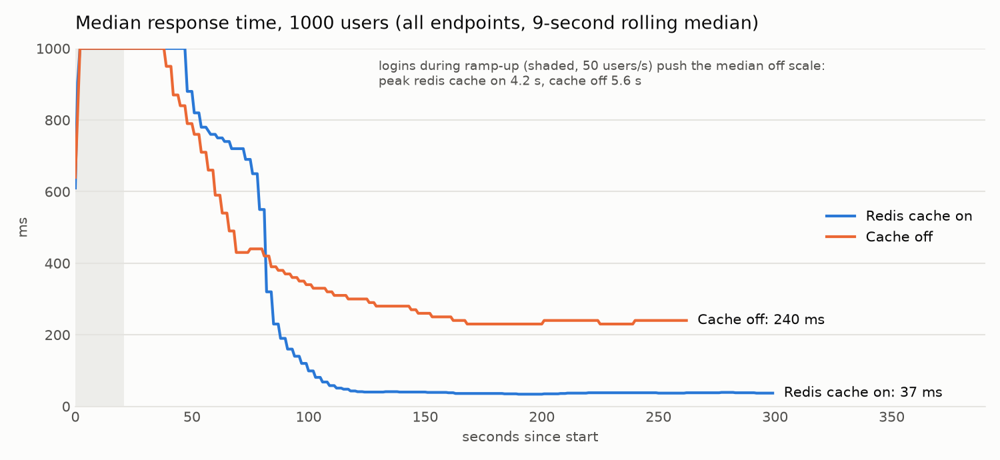
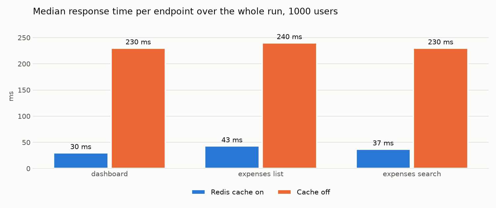

# Test report

ExpenseFlow · Rreze Konjusha · runs of 1 and 2 October 2026 · branch `develop` plus the open pull requests named below

**Result.** Every functional, API, end-to-end and security test passes: 85 backend tests at 94.18% coverage (gate 80%),
42/42 Newman assertions, 9/9 Cypress tests, 12/12 security tests, 0 High findings in two OWASP ZAP scans, and 0 failed requests out of 233,419 in two
1000-user load runs. One non-functional target is not met: dashboard p95 stays near 1.2 s under 1000 users on a
single API replica (target 800 ms). Fourteen defects were found and fixed during testing.

## 1. Environment

| Item | Value |
| --- | --- |
| Machine | MacBook Pro, 10 CPU cores, 16 GB RAM; Docker Desktop with 10 CPUs and 8 GB |
| Stack under test | `docker-compose.yml` + `docker-compose.ci.yml` (the test and staging environment): Caddy, 1 API replica (gunicorn, 3 workers x 2 threads), Celery worker, PostgreSQL 16, MongoDB 7, Redis 7 |
| Data | `seed_demo --reset`: 3 departments, 9 users, 4 projects, 154 expenses, 1 saved report |
| CI | GitHub Actions on every pull request: backend (real PostgreSQL, MongoDB, Redis), frontend, Docker stack + Newman + Cypress + real-Chrome session test |

## 2. Results by layer

| Layer | Tool | Scope | Result |
| --- | --- | --- | --- |
| Unit | pytest | Policies, state transitions, models, triggers, procedure | part of 85 passed |
| Integration | pytest-django on PostgreSQL | Every endpoint: happy, negative, edge | part of 85 passed |
| Integration (real services) | pytest on MongoDB and Redis containers in CI | Indexes, write concern, cache versioning, throttle counters | 87 passed, 0 skipped (CI run on PR #82) |
| Coverage | pytest-cov | `apps/`, gate 80% | **94.18%** |
| Security | pytest `-m security` | SQLi, XSS, authN, authZ, brute force, CSRF, headers | **12/12** |
| API contract | Postman + Newman through Caddy over HTTPS | 28 requests: auth, CRUD, workflow, reports, errors | **42/42 assertions** |
| End-to-end | Cypress 13, Chrome | Register + activate + login; create + submit; manager approves; admin report + export + reimburse + audit | **4 specs, 9/9 tests** |
| Session robustness | Puppeteer, real Chrome | Leaving pages mid-refresh keeps the session | **10/10** (0/5 before the fix) |
| Load | Locust | 1000 users, 5 minutes, cache on and off | 0 failures; see section 4 |
| Vulnerability scan | OWASP ZAP baseline and API scan | Web app and all 71 API operations | **0 High**; 2 Low fixed, rest accepted with reasons |
| Backup and restore | `scripts/backup.sh`, `scripts/restore.sh` | Delete everything, restore, compare | All 5 checked values identical |

## 3. Test cases

| ID | Layer | Scenario | Expected | Test | Type | Result |
| --- | --- | --- | --- | --- | --- | --- |
| TC-01 | Integration | Register, open email link, activate, log in | 201, 200, 200 with httpOnly cookie | `test_register_activate_login` | Happy | Pass |
| TC-02 | Integration | Reuse the activation link | 400 | `test_register_activate_login` | Negative | Pass |
| TC-03 | Security | Reuse an old refresh token after rotation | 401 | `test_refresh_rotation_and_reuse_detection` | Security | Pass |
| TC-04 | Unit | Meal 60 EUR with 1 attendee | Policy error on amount | `test_meal_cap_per_attendee` | Negative | Pass |
| TC-05 | Unit | Expense exactly 90 days old | Accepted | `test_edge_exactly_90_days_ok` | Edge | Pass |
| TC-06 | Integration | Manager approves own department's expense | 200, project.spent increases | `test_workflow_submit_approve` | Happy | Pass |
| TC-07 | Integration | Approve when the budget would be exceeded | 409, status unchanged | `test_budget_exceeded_is_409` | Negative | Pass |
| TC-08 | Integration | Approve a draft | 409 invalid transition | `test_invalid_transition_is_409` | Negative | Pass |
| TC-09 | Security | Employee approves own expense | 403 | `test_user_cannot_approve_own` | Security | Pass |
| TC-10 | Security | Manager of another department opens it | 404 | `test_manager_of_other_department_cannot_see` | Security | Pass |
| TC-11 | Security | `q=' OR 1=1 --` and two more payloads | 200, no rows leaked | `test_sql_injection_in_search_is_harmless` | Security | Pass |
| TC-12 | Security | `<script>` in description | 400 | `test_xss_rejected_in_text_fields` | Security | Pass |
| TC-13 | Security | 6 logins in one minute | 6th returns 429 | `test_login_throttle_429` | Security | Pass |
| TC-14 | Integration | Import 5 CSV rows, 2 invalid | 3 created, errors for rows 4 and 5 | `test_import_csv_with_row_errors` | Edge | Pass |
| TC-15 | Integration | Report by department, export XLSX | Correct totals, valid workbook | `test_report_by_department_values`, `test_save_list_export_delete_snapshot` | Happy | Pass |
| TC-16 | Database | Delete a parent expense row in SQL | Subtype row removed (ON DELETE CASCADE) | `test_subtype_row_cascades_at_db_level` | DB | Pass |
| TC-17 | Database | `sp_mark_reimbursed(today)` | Returns the count of approved rows | `test_stored_procedure_reimburses` | DB | Pass |
| TC-18 | E2E | Employee creates and submits a meal | SUBMITTED in the UI | Cypress spec 2 | Happy | Pass |
| TC-19 | Load | 1000 users, 5 minutes, cache on | Dashboard p95 < 800 ms | Locust run 1 | Performance | **Fail** (870 ms whole run, about 1.2 s steady state) |
| TC-20 | Security | Expired access token | 401 | `test_expired_access_token_is_401` | Security | Pass |
| TC-21 | Security | Only the refresh cookie, no bearer header, POST an expense | 401 (CSRF does not apply) | `test_cookie_alone_cannot_write` | Security | Pass |
| TC-22 | Security | 5 failed logins, then the right password | Refused (403 or 429); lock lasts 15 min by configuration | `test_account_lockout_after_5_failures` | Security | Pass |
| TC-23 | Security | Security headers on API responses | nosniff, X-Frame-Options DENY, X-Request-ID | `test_security_headers` | Security | Pass |
| TC-24 | Integration | Export a cell starting with `=` | Neutralised against formula injection | `test_csv_formula_injection_is_neutralised` | Security | Pass |
| TC-25 | E2E | Leave pages while the token refresh is running | Still signed in | `tests/browser/refresh-race.mjs` | Edge | Pass (10/10) |
| TC-26 | Operations | Delete all expenses and both Mongo collections, restore | Counts, sums and budget state identical | `scripts/restore.sh` | Recovery | Pass |
| TC-27 | E2E | Admin opens `/admin/audit` directly | SPA page, not Django admin | Cypress spec 4 | Negative | Pass (after fix D2) |

## 4. Performance (Locust)

Each run: 1000 simulated users, 50 new users per second, 5 minutes, think time 1 to 3 s, tasks weighted dashboard 5,
expense list 3, full-text search 1, one login per user. The per-IP limits are lifted for the run
(`tests/locust/docker-compose.load.yml`) because every simulated user comes from one address.

| Endpoint | Cache on: requests | median | p95 | p99 | Cache off: requests | median | p95 | p99 |
| --- | --- | --- | --- | --- | --- | --- | --- | --- |
| dashboard | 71,392 | 30 ms | 870 ms | 4.6 s | 57,286 | 230 ms | 880 ms | 6.4 s |
| expenses list | 42,785 | 43 ms | 870 ms | 4.3 s | 34,308 | 240 ms | 880 ms | 6.4 s |
| expenses search | 14,165 | 37 ms | 880 ms | 4.6 s | 11,483 | 230 ms | 880 ms | 6.3 s |
| login | 1,000 | 4.5 s | 11 s | 12 s | 1,000 | 5.6 s | 9.7 s | 11 s |
| **all** | **129,342 (431/s)** | **36 ms** | **950 ms** | 6.1 s | **104,077 (393/s)** | **240 ms** | **920 ms** | 7.1 s |

Failures: 0 in both runs.





**Analysis.**

1. **The Redis cache makes the typical request 6 to 8 times faster**: the median falls from 230 to 30 ms on the
   dashboard and throughput rises 10% (393 to 431 requests/s).
2. **Uncached endpoints get faster too** (240 to 43 ms on the list). The dashboard is the heaviest query; without the
   cache it holds the six worker threads longer, so every request queues behind it.
3. **The tail is set by saturation, not by the cache.** From 60 s after all users are running to the end, the p95
   stays near 1.2 s in both runs. One API replica has 6 threads for about 450 requests per second; requests wait in the
   queue. The ramp-up peak (median 4 to 6 s for the first 40 s) comes from 1,000 password hashes in 20 seconds:
   PBKDF2 is slow on purpose.
4. **NFR-04 is not met on one replica.** The architecture answer is horizontal scaling: the API is stateless and Caddy
   balances across replicas (`docker compose up --scale api=3`). A 3-replica run is the next measurement. Two attempts
   on the same laptop were discarded: the first hit a backlog left by an interrupted run, the second ran after the
   laptop switched to battery power and throttled its CPU. It has to be repeated on mains power, and with the load
   generator on a second machine so it does not compete with the replicas for CPU.

## 5. Security scan (OWASP ZAP)

Two scans with OWASP ZAP (stable image), both against the full stack through the Caddy gateway over HTTPS: the
**baseline scan** (spider plus passive rules on the web app) and the **API scan**, which imports the OpenAPI
specification and runs active attacks (injection, path traversal, header and parameter tampering) against every
endpoint. Reports: `test-results/zap/`.

| Scan | URLs | FAIL (High) | WARN | PASS |
| --- | --- | --- | --- | --- |
| Baseline, first run | web app | 0 | 6 | 61 |
| API scan (71 operations from OpenAPI) | 127 | **0** | 3 | 117 |
| Baseline after fixes | web app | **0** | 6 (2 lowered to informational) | 61 |

**No High findings.** Every warning, and what was done:

| Finding | Risk | Decision |
| --- | --- | --- |
| No Cache-Control on the app shell and API | Low | **Fixed**: app shell `no-cache`, hashed assets `immutable`, API `no-store` (D12) |
| Cross-Origin-Opener-Policy / Resource-Policy missing | Low | **Fixed**: both `same-origin` (D13) |
| Cross-Origin-Embedder-Policy missing | Low | Accepted: `require-corp` can break embedded resources; no cross-origin content to isolate |
| CSP allows `style-src 'unsafe-inline'` | Medium | Accepted: MUI injects styles at runtime; `script-src` stays `'self'`, which is what stops XSS |
| Timestamp disclosure in `mui-*.js` | Low | False positive: a constant inside the MUI library |
| Unexpected Content-Type (78) | Low | Expected: ZAP probes paths the SPA answers with its HTML shell |
| Modern web application, storable content | Informational | No action |
| One 502 on `PATCH /projects/10/` during the active scan | Low | Investigated: Django answered 401 but the gateway saw the upstream close first (EOF). Not reproducible in 38 timed attempts; no data exposed. Most likely gunicorn closing the connection before reading the attack body. Logged as a known issue |

ZAP needs SNI to reach Caddy; Java sends none for a dotless name such as `localhost`, so the scans use the extra
name `ef.localhost` (local certificate, temporarily allowed in `ALLOWED_HOSTS`).

## 6. Defects found and fixed

| ID | Found by | Defect | Fix | Issue / PR |
| --- | --- | --- | --- | --- |
| D1 | First `compose up --build` | api and worker built the same image tag in parallel; build failed | Only api builds; worker reuses the image | #72 / #1 |
| D2 | Cypress spec 4 | Caddy routed SPA pages `/admin/*` to Django admin | Django admin moved to `/django-admin/` | #73 / #1 |
| D3 | Cypress spec 1 | Test read Mailpit before Celery sent the email | Poll for the email | #74 / #1 |
| D4 | Cypress specs 2 to 4 | `cy.session` restored a refresh cookie that rotation had blacklisted | Log in through the API per test | #74 / #1 |
| D5 | Cypress spec 4 | Download check read a directory | Assert the XLSX response | #74 / #1 |
| D6 | Real-Chrome test | Leaving a page mid-refresh signed the user out | keepalive refresh, 2 s cross-page wait, Web Locks | #78 / #85 |
| D7 | Screenshots | App bar covered the product name on desktop | Name moved into the app bar | #90 / #91 |
| D8 | Load test setup | `DASHBOARD_CACHE_SECONDS` hard-coded, so "cache off" kept the cache | Read from the environment, with a test | #64 / #94 |
| D9 | CI | MongoDB service health check used an invalid command | `db.runCommand({ping:1})` | #76 / #82 |
| D10 | CI on `main` | Deploy job failed on every push without a server | Skips with a notice until the server is set up | #17 / #83 |
| D11 | Demo rehearsal | Demo step 3 fixed a 60 EUR meal with 2 attendees, still over the cap | Script uses 3 attendees | #77 / #84 |
| D12 | ZAP baseline | No Cache-Control: a stale app shell could survive a deploy; API answers storable | Shell no-cache, assets immutable, API no-store | #65 / #94 |
| D13 | ZAP baseline | Cross-origin isolation headers missing | COOP and CORP same-origin | #65 / #94 |
| D14 | Deploy preparation | `.env.example` recommended `smtp+tls://` for production email, a scheme the parser does not know: the API would crash at start with KeyError | Documented `submission://` (STARTTLS), checked against the parser | #99 |

## 7. Known issues and recommendations

| Item | Recommendation |
| --- | --- |
| Dashboard p95 about 1.2 s at 1000 users on one replica | Run with 3 API replicas; add a database index review for the list query; consider a lighter password hasher only for load tests, never in production |
| Rare 502 when an unauthenticated request with a body is refused early | Read the request body before answering, or put gunicorn behind a buffering worker class; retest with ZAP |
| Rotation is strict: a refresh aborted by the network (not by navigation) still signs the user out | Acceptable for this project; a short server-side grace period for the previous token would remove it |

## 8. How to reproduce

```bash
docker compose -f docker-compose.yml -f docker-compose.ci.yml up -d --build
docker compose exec api python manage.py seed_demo --reset
cd backend && pytest --cov                     # unit, integration, coverage
pytest -m security                             # security suite
npx newman run tests/postman/expenseflow.postman_collection.json -e tests/postman/ci.postman_environment.json --insecure
cd frontend && npx cypress run --browser chrome
docker compose -f docker-compose.yml -f docker-compose.ci.yml -f tests/locust/docker-compose.load.yml up -d
locust -f tests/locust/locustfile.py --host https://localhost --headless -u 1000 -r 50 -t 5m --processes 4 --csv results/load/cache-on
python tests/locust/plot.py docs/test-results/load
```
