# User manual

ExpenseFlow has three roles. **Employees** claim expenses, **managers** also approve their department's claims,
**admins** also manage people and projects, reimburse, report and read the audit log. The menu on the left shows only
what your role may use; on a phone it opens from the menu button at the top left.

## 1. Getting started

**Create an account**

1. Open the site and click **Create account**.
2. Fill in **First name**, **Last name**, **Work email**, **Password** (at least 10 characters, not a common
   password) and **Repeat password**, then click **Create account**.
3. The page says **Check your inbox**. Open the activation email and click the link. The link works once.
4. Sign in with your email and password.
5. Ask an admin to put you in a department and add you to the projects you work on; you can only claim expenses
   against your projects.

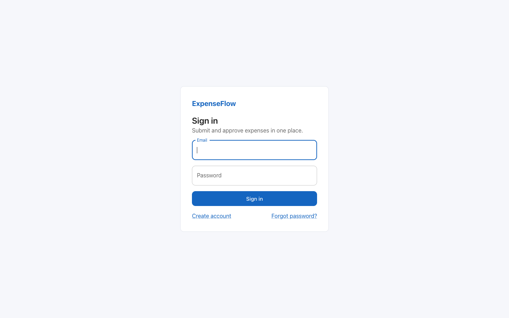

**Forgot your password?** On the sign-in page click **Forgot password?**, enter your **Email**, open the email and
choose a new password. For your security the page answers the same whether or not the email has an account.

**Stay signed in.** You stay signed in for up to 7 days while you use the site. **Log out** (menu under your initial, top right)
ends the session on this device; changing your password ends it on every device.

## 2. Employees

**Dashboard.** After signing in you see your expenses waiting for approval, what was paid out this month, your drafts
and rejected claims, a chart of the last 6 months and your spending by type.

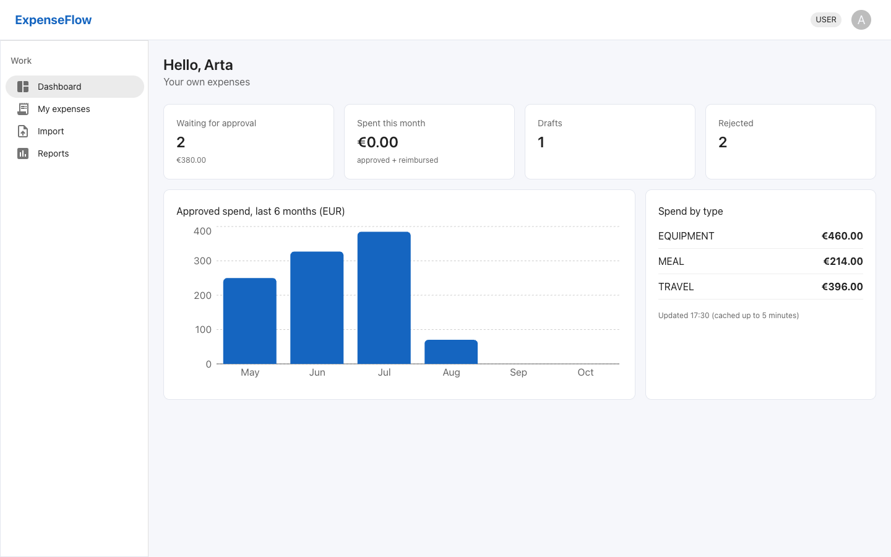

**Create an expense**

1. Click **My expenses**, then **New expense**.
2. Choose the **Type**. The form changes with it: Meal asks for **Attendees**, Travel for **Distance (km)** and
   **Destination**, Equipment for **Item** and **Serial number**.
3. Choose the **Project**, enter the **Amount (EUR)**, the **Date** and a **Description**.
4. Click **Save draft**. The expense is saved as a **DRAFT**; nobody else sees it yet.

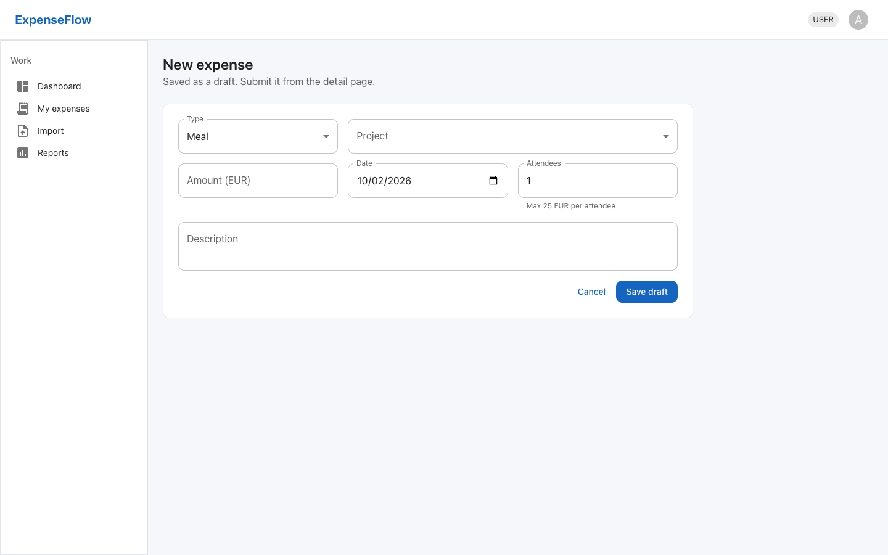

Company policy is checked when you save and when you submit:

| Type | Limit |
| --- | --- |
| Meal | 25 EUR per attendee |
| Travel | 0.40 EUR per km |
| Equipment | 1000 EUR, serial number required |
| All | not in the future, at most 90 days old, a project you are a member of |

If a rule is broken, the field turns red and says why, for example "Meals are capped at 25.00 EUR per attendee".

**Submit for approval.** Open the draft and click **Submit**. While it is a draft you can also **Edit** or
**Delete** it; after submitting it can no longer be changed.

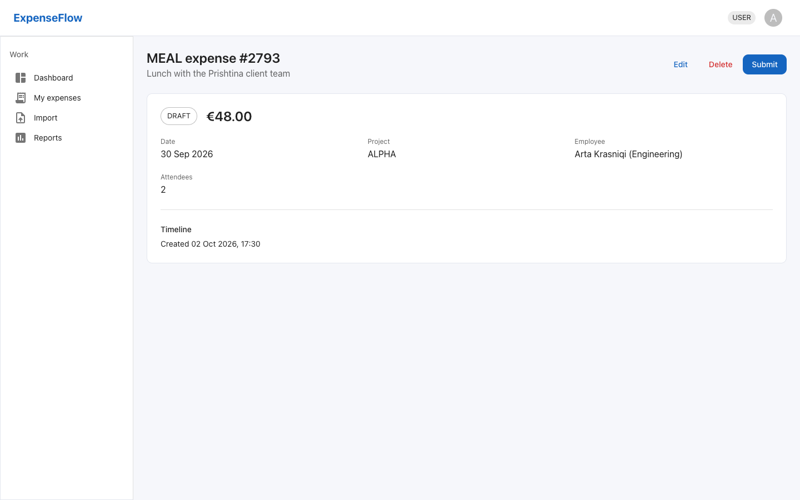

**If it is rejected.** The expense shows **Rejected:** and the manager's reason. Click **Reopen**, fix it, and
submit again.

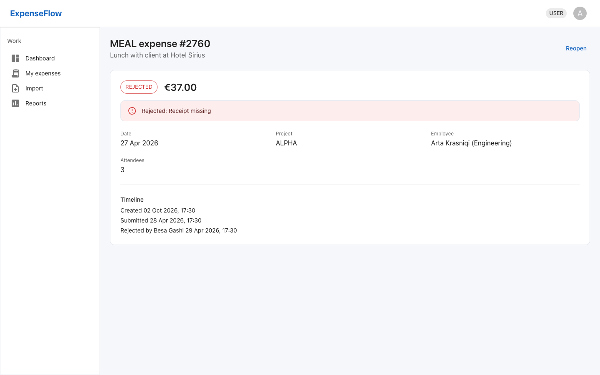

**Import many expenses at once**

1. Click **Import**, then **Download CSV template** and fill it in (one row per expense; CSV or JSON, up to 500
   rows).
2. Click **Choose file**, pick your file and click **Import**.
3. Valid rows become drafts. Rows with a problem are listed with the row number and the reason; fix them and import
   those rows again.

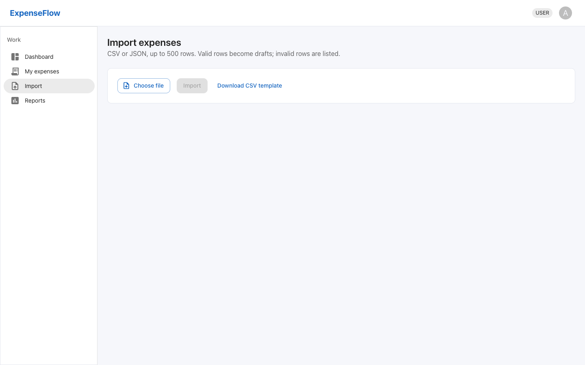

**Find an expense.** In **My expenses**, type words from the description in **Search description**, or filter by
**Status**, **Type** and the **From** and **To** dates. Click a column title to sort; click a row to open it.

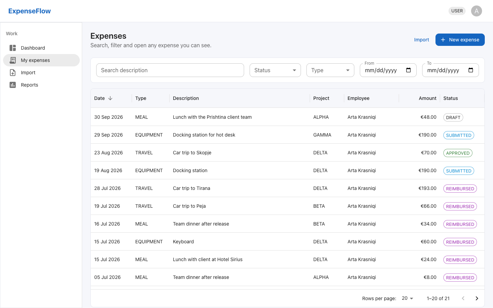

**Profile.** Click your initial at the top right, then **Profile**, to change your name (**Save**) or your password
(**Current password**, **New password**, **Repeat new password**, **Change password**).

## 3. Managers

Managers can do everything employees can, plus:

**Approve or reject**

1. Click **Approvals**. You see the submitted expenses of your department, oldest first. Search narrows the list.
2. Click **Approve**, or **Reject** and type the **Reason (shown to the employee)**.
3. You cannot decide on your own expenses; another manager or an admin does.

If the approval would take the project over its budget, it is refused with "Project ... budget would be exceeded";
ask an admin to raise the budget.

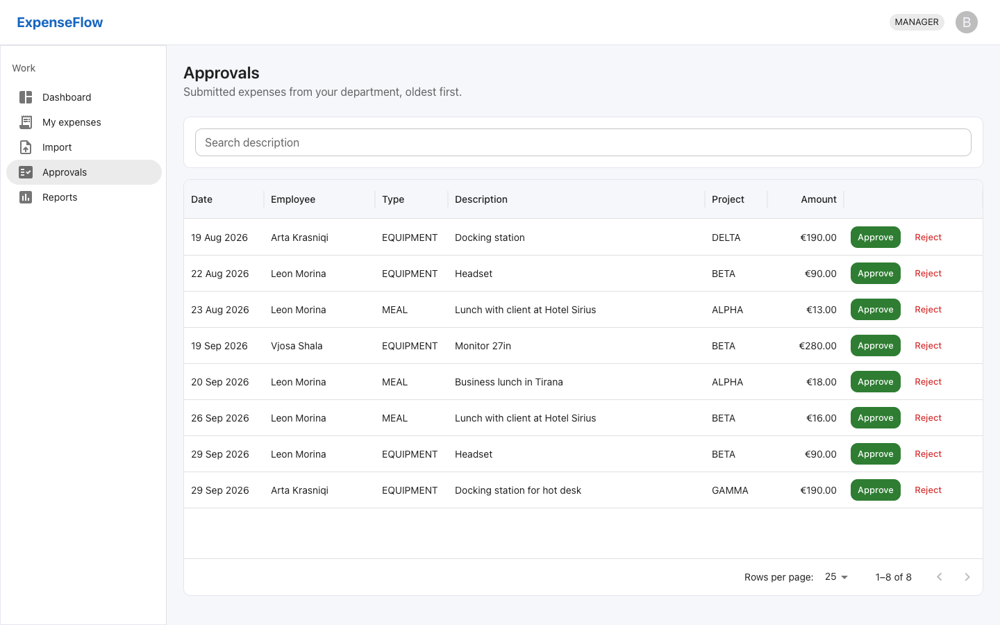

Your dashboard shows the figures of your whole department. In **My expenses**, **Only mine** switches between your
own claims and your department's.

## 4. Admins

Admins can do everything managers can, for all departments, plus:

**Users.** **Users** > **New user**: email, name, **Role** (USER, MANAGER, ADMIN) and **Department**. **Edit**
changes them; **Deactivate** stops a person from signing in while keeping their history (users are never deleted).

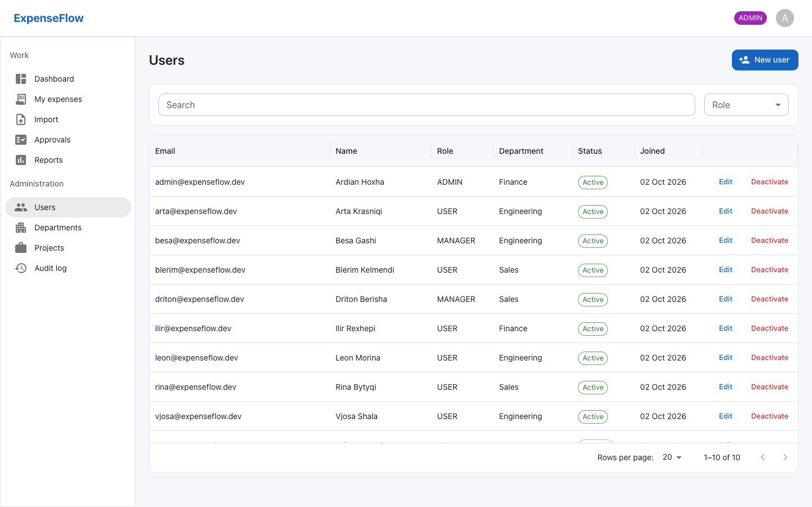

**Departments.** **Departments** > **New department**: a **Name** and its **Manager**.

**Projects.** **Projects** > **New project**: **Code**, **Name**, **Budget (EUR)**, **Members** and **Active**. The
**Budget used** column shows how much is already approved; the database refuses approvals beyond the budget.

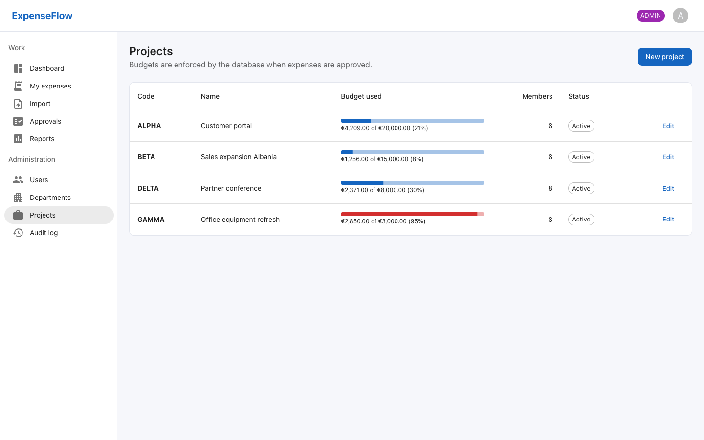

**Reports**

1. Click **Reports**. Choose **From** and **To**, **Group by** (department, project, employee, type, status or month)
   and, if you want, statuses, types, departments and projects.
2. Click **Run report**: a chart and a table with the count and total per group.
3. Click **Save report** and give it a **Name**. It appears under **Saved reports**.
4. Open a saved report and click **CSV**, **XLSX** or **JSON** to download it.

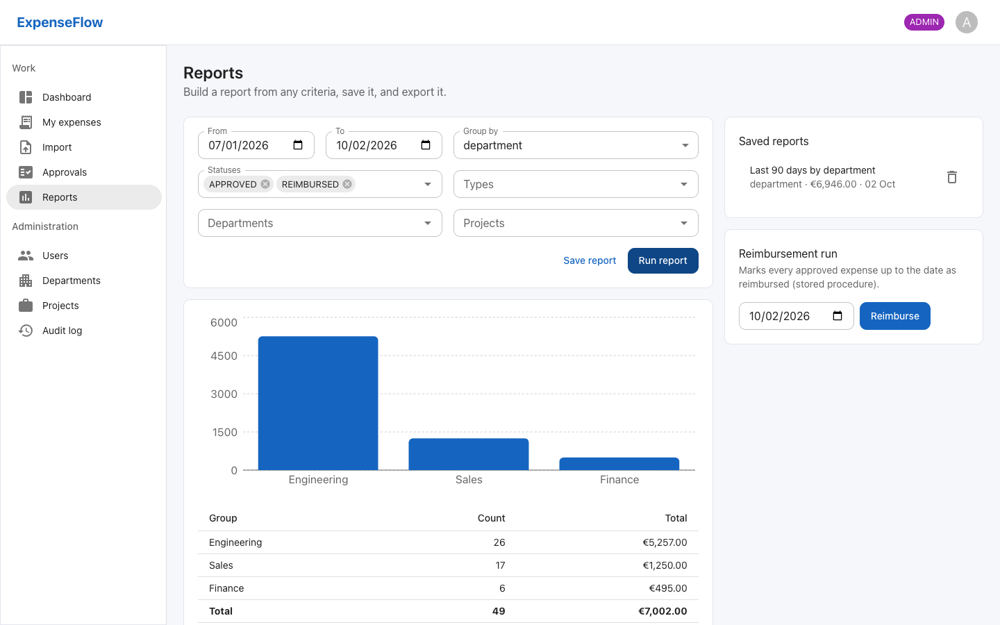

**Reimbursement.** On the **Reports** page, under **Reimbursement run**, pick a date and click **Reimburse**. Every
approved expense up to that date becomes **REIMBURSED**, and the page says how many.

**Audit log.** **Audit log** lists every important action: who did it, when, from which address. Filter by action
(for example `EXPENSE_APPROVED`) and by dates; click a row to see the details and what changed.

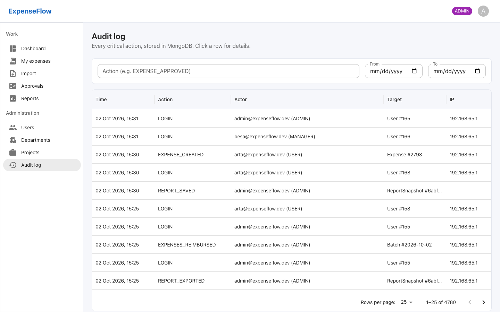

## 5. Messages and what to do

| Message | Meaning | What to do |
| --- | --- | --- |
| Wrong email or password | The details do not match | Check them; after 5 wrong attempts the account is locked for 15 minutes |
| Too many attempts. Wait a minute and try again. | More than 5 tries in a minute | Wait one minute |
| The link is invalid or has expired | An activation or reset link was already used or is too old | Request a new one |
| Meals are capped at 25.00 EUR per attendee | A policy rule is broken | Fix the amount or the details, as the message says |
| You are not a member of this project | You may not claim against that project | Ask an admin to add you |
| Project ... budget would be exceeded | The project has no budget left | An admin raises the budget |
| Only drafts can be edited | The expense was already submitted | Ask the manager to reject it, then reopen it |
| You are back on the sign-in page | Your session ended (7 days unused, or your password was changed) | Sign in again |
